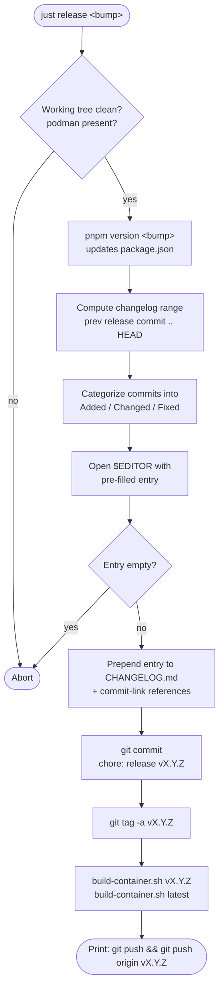
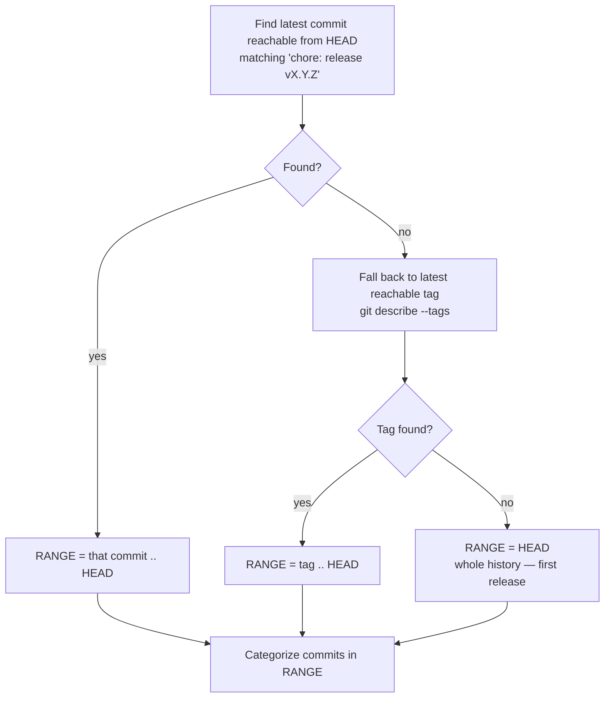
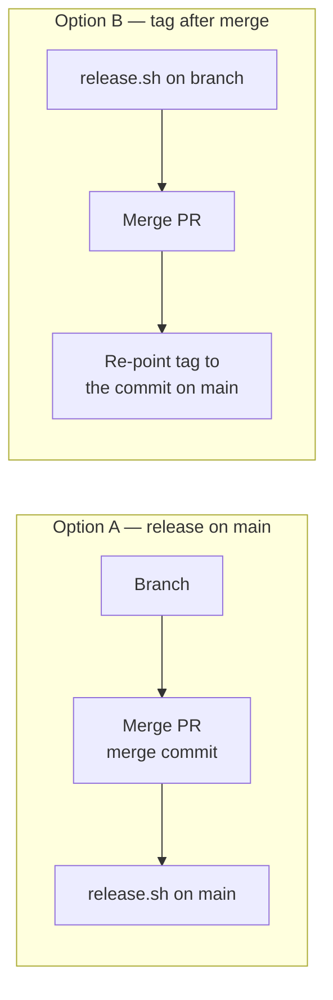

# Releasing a new version

This guide covers cutting a release with `scripts/release.sh`: bumping the
version, generating the `CHANGELOG.md` entry, tagging, and building + pushing the
container image.

Releases follow [Semantic Versioning](https://semver.org/) and the changelog
follows [Keep a Changelog](https://keepachangelog.com/).

## Prerequisites

- A clean working tree (no staged or unstaged changes) — the script aborts
  otherwise.
- `podman` on your `PATH` (used for the container build + push).
- `pnpm` installed.

## Run it

```sh
just release patch     # 0.3.0 -> 0.3.1
just release minor     # 0.3.0 -> 0.4.0
just release major     # 0.3.0 -> 1.0.0

# equivalently:
./scripts/release.sh <major|minor|patch>
```

The script opens `$EDITOR` with a pre-filled changelog entry. Trim/curate it,
save, and quit to continue.

## What the script does



The script **does not push** for you. After it finishes it prints the exact
commands to run:

```sh
git push && git push origin vX.Y.Z
```

## How the changelog range is computed

The changelog should list only the commits added **since the previous release**.
The script anchors the range on the most recent `chore: release vX.Y.Z` commit
that is reachable from `HEAD`, then collects everything after it:



Conventional-commit subjects are mapped into Keep a Changelog sections:

| Commit type                | Changelog section |
| -------------------------- | ----------------- |
| `feat`                     | **Added**         |
| `fix`                      | **Fixed**         |
| `perf`, `refactor`, `revert` | **Changed**     |
| anything uncategorized     | **Changed**       |
| merges, `docs` `chore` `test` `ci` `build` `style` | *dropped* |

> **Why anchor on the release commit instead of a tag?**
> `git describe --tags` only considers tags reachable from `HEAD`. If a release
> branch is **rebase-merged**, GitHub rewrites its commits onto `main` with new
> hashes and the version tag is left pointing at the original (now unreachable)
> commit. `git describe` then silently falls back to an *older* tag, and the next
> release's changelog bleeds in commits that already shipped. Anchoring on the
> `chore: release …` commit — which always lands on `main` — avoids this.

## Recommended branch workflow

Because rebase-merging detaches version tags from `main`, prefer one of:



- **Option A (simplest):** run `release.sh` only on an up-to-date `main`, so the
  release commit and tag are created directly on the mainline.
- **Option B:** if you must release from a branch that gets rebase-merged,
  re-point the tag to the commit that actually landed on `main` after the merge:
  ```sh
  git tag -f -a vX.Y.Z <commit-on-main> -m "Release vX.Y.Z"
  git push origin vX.Y.Z --force
  ```

## After releasing

1. Push the commit and tag (the script prints the command).
2. The container image is already built and pushed for `vX.Y.Z` and `latest`.
   See [Publishing the image to ghcr.io](./publishing-image-to-ghcr.md) for the
   registry details and [Self-hosting with Podman Quadlet](./self-hosting-podman-quadlet.md)
   to deploy it.
